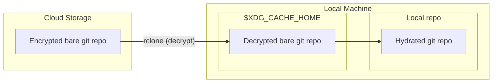
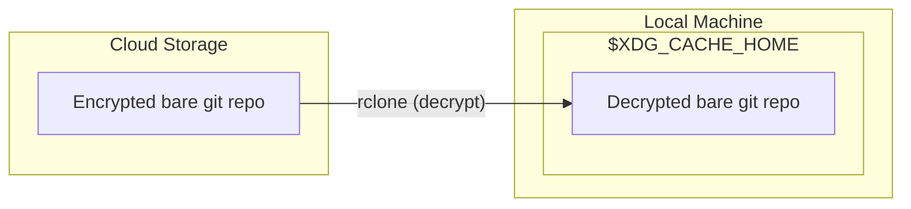
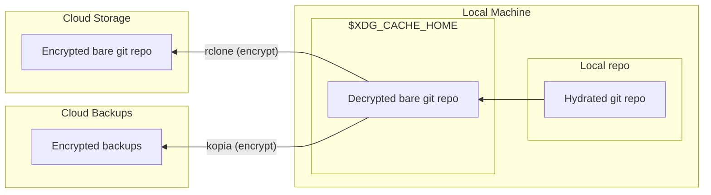

# git-remote-rclone
This is a small [git remote helper](https://git-scm.com/docs/gitremote-helpers), which allows hosting a git repo in cloud storage (s3, etc.), in _encrypted_ format.

Technologies used:
- [rclone](https://rclone.org/) for encrypted sync to the cloud
- [kopia](https://kopia.io/) for encrypted backups to the cloud

## How it works
This helper introduces a custom `rclone::` protocol for git remotes. i.e.
```bash
git remote add origin "rclone::${rclone_remote_path}"
```
where `rclone_remote_path` refers to any valid [rclone remote path](https://rclone.org/docs/#syntax-of-remote-paths).

This helper supports two basic operations:
- `git fetch` (read from remote)
- `git push` (write to remote)

(For more details, read the source code!!)

### git fetch

    
### git push
The `git push` operation is a bit more complex. FIRST, ensure that the local cache is up-to-date:


Now, we upload to the cloud.

Also, since this is a "write" operation, store a backup of the bare git repo, just in case:


> [!NOTE]
> The push from the local repo to local cache is important - it helps detect and prevent bad scenarios, i.e. when the push might overwrite a commit in the remote.

## Installation
Download the file `git-remote-rclone`, and make it available in `PATH`.

Other required dependencies:
- bash
- [rclone](https://rclone.org/)
- [kopia](https://kopia.io/)

## Setup
### Configure rclone on your machine
- Use the [rclone docs](https://rclone.org/crypt/) 
- Set up an _encrypted_ remote

### FIRST TIME ONLY: Create a bare git repo locally, then sync to rclone
```bash
BARE_DIR=/tmp/repo-bare
REPO_DIR=/tmp/repo
mkdir -p $BARE_DIR && cd $BARE_DIR
git init --bare
rm ./hooks/* # hooks not needed

git clone $BARE_DIR $REPO_DIR
cd $REPO_DIR
git commit --allow-empty -m "first commit"
git branch -m master main
git push -u origin main

cd $BARE_DIR
git symbolic-ref HEAD refs/heads/main # change HEAD to the main branch
rclone sync $BARE_DIR rclone-remote:path/to/use
```

### Clone the repo to a new machine
NOTE: `git clone` does NOT work! Use this instead:
```bash
mkdir ./cloned && cd ./cloned
git init
git remote add origin "rclone::rclone-remote:path/to/use"
git fetch
git checkout main
```

### Set up kopia for backups
- If setting up for the first time, use [kopia repository create](https://kopia.io/docs/getting-started/#creating-a-repository)
- Otherwise, use [kopia repository connect](https://kopia.io/docs/getting-started/#connecting-to-repository)
- Set up the [kopia policy](https://kopia.io/docs/getting-started/#policies). Here are my default values:
```
Retention:
  Annual snapshots:                     0   (defined for this target)
  Monthly snapshots:                    0   (defined for this target)
  Weekly snapshots:                     0   (defined for this target)
  Daily snapshots:                     90   (defined for this target)
  Hourly snapshots:                     0   (defined for this target)
  Latest snapshots:                   200   (defined for this target)
  Ignore identical snapshots:        true   (defined for this target)
```

## Usage
Use `git fetch` and `git push` as normal.

**KNOWN LIMITATIONS:**
- `git fetch` sometimes shows an error, even though the fetch was successful
- The first `git pull` won't work
    - Instead, you can do `git fetch` and then `git pull` (or `git pull` twice)

## Tests
We use the [bats](https://github.com/bats-core/bats-core) test framework.

Install dependencies:
- Install the `bats` binary to `PATH`.
- Install the test helper submodules, `git submodule update --init --recursive`

Run tests:
```bash
bats ./test
```

## Alternatives
Here's a list of alternatives I considered. These aren't inherently bad, but none of them fits my personal use case.

Also the source code for these projects seem more complex than my small ~50-line bash script 😛

| Project Name | Why not? |
|-|-|
|[spwhitton/git-remote-gcrypt](https://github.com/spwhitton/git-remote-gcrypt)|Requires messing with [gpg](https://www.gnupg.org/). Also, seems unmaintained.|
|[Keybase encrypted git](https://keybase.io/blog/encrypted-git-for-everyone)|Requires trusting a separate company to handle the encryption.<br><br>I'd rather roll my own and have a bit more fine-grained control over my data.|
|[CGamesPlay/git-remote-restic](https://github.com/CGamesPlay/git-remote-restic)|Requires a custom fork of [restic](https://restic.net/).|
|[nathants/git-remote-aws](https://github.com/nathants/git-remote-aws)|Stores some metadata unencrypted.|
|[GenerousLabs/git-remote-encrypted](https://github.com/GenerousLabs/git-remote-encrypted)|Seems unmaintained. Also only 7 GitHub stars (as of 2024-04-26)|
